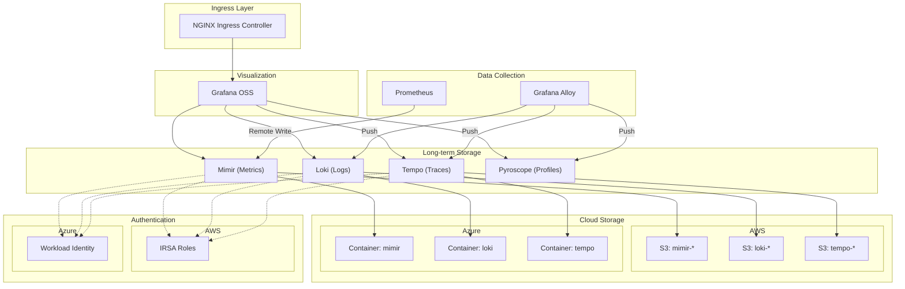

# Grafana OSS Observability Stack

A production-ready Terraform module for deploying a complete observability stack on Kubernetes, supporting both **AWS (EKS)** and **Azure (AKS)** cloud providers.

## Overview

This module deploys and configures:

| Component      | Purpose                    | Storage               |
| -------------- | -------------------------- | --------------------- |
| **Grafana**    | Visualization & Dashboards | -                     |
| **Prometheus** | Metrics collection         | Remote write to Mimir |
| **Mimir**      | Long-term metrics storage  | S3 / Azure Blob       |
| **Loki**       | Log aggregation            | S3 / Azure Blob       |
| **Tempo**      | Distributed tracing        | S3 / Azure Blob       |
| **Pyroscope**  | Continuous profiling       | Local                 |

## Architecture



## Features

- **Multi-Cloud Support**: Deploy on AWS EKS or Azure AKS with a single module
- **Component Toggles**: Enable/disable individual components as needed
- **Cloud-Native Auth**: IRSA (AWS) or Workload Identity (Azure) - no static credentials
- **Alerting Integration**: Built-in support for Slack and Microsoft Teams
- **SSO Ready**: Configure OIDC/OAuth2 authentication for Grafana
- **Production Defaults**: Sensible resource requests/limits and storage configurations
- **Automatic Datasources**: Grafana pre-configured with all component datasources
- **Folder Organization**: Structured Grafana folders for dashboards and alerts

## Quick Start

### AWS (EKS)

```hcl
module "observability" {
  source = "github.com/WeAura/weaura-terraform-modules//modules/grafana-oss?ref=v1.0.0"

  # Cloud Configuration
  cloud_provider = "aws"
  aws_region     = "us-east-1"
  environment    = "production"
  project_name   = "myproject"

  # EKS Configuration
  eks_cluster_name       = "my-eks-cluster"
  eks_oidc_provider_arn  = "arn:aws:iam::123456789012:oidc-provider/oidc.eks.us-east-1.amazonaws.com/id/EXAMPLED539D4633E53DE1B71EXAMPLE"
  eks_oidc_provider_url  = "oidc.eks.us-east-1.amazonaws.com/id/EXAMPLED539D4633E53DE1B71EXAMPLE"

  # Components (all enabled by default)
  enable_grafana    = true
  enable_prometheus = true
  enable_mimir      = true
  enable_loki       = true
  enable_tempo      = true
  enable_pyroscope  = true

  # Ingress
  grafana_ingress_enabled = true
  grafana_ingress_host    = "grafana.example.com"

  # Alerting
  alerting_provider            = "slack"
  slack_webhook_secret_name    = "observability/slack-webhook"

  tags = {
    Team        = "platform"
    CostCenter  = "infrastructure"
  }
}
```

### Azure (AKS)

```hcl
module "observability" {
  source = "github.com/WeAura/weaura-terraform-modules//modules/grafana-oss?ref=v1.0.0"

  # Cloud Configuration
  cloud_provider = "azure"
  environment    = "production"
  project_name   = "myproject"

  # Azure Configuration
  azure_subscription_id = "00000000-0000-0000-0000-000000000000"
  azure_resource_group  = "rg-observability"
  azure_location        = "eastus"

  # AKS Configuration
  aks_cluster_name     = "my-aks-cluster"
  aks_oidc_issuer_url  = "https://eastus.oic.prod-aks.azure.com/00000000-0000-0000-0000-000000000000/00000000-0000-0000-0000-000000000000/"

  # Components
  enable_grafana    = true
  enable_prometheus = true
  enable_mimir      = true
  enable_loki       = true
  enable_tempo      = true
  enable_pyroscope  = true

  # Ingress
  grafana_ingress_enabled = true
  grafana_ingress_host    = "grafana.example.com"

  # Alerting
  alerting_provider           = "teams"
  teams_webhook_secret_name   = "observability-teams-webhook"
  azure_key_vault_name        = "kv-observability"

  tags = {
    Team        = "platform"
    CostCenter  = "infrastructure"
  }
}
```

### Minimal (Grafana + Prometheus only)

```hcl
module "observability" {
  source = "github.com/WeAura/weaura-terraform-modules//modules/grafana-oss?ref=v1.0.0"

  cloud_provider = "aws"
  aws_region     = "us-east-1"
  environment    = "dev"
  project_name   = "myproject"

  eks_cluster_name       = "my-eks-cluster"
  eks_oidc_provider_arn  = "arn:aws:iam::123456789012:oidc-provider/..."
  eks_oidc_provider_url  = "oidc.eks.us-east-1.amazonaws.com/id/..."

  # Only Grafana and Prometheus
  enable_grafana    = true
  enable_prometheus = true
  enable_mimir      = false
  enable_loki       = false
  enable_tempo      = false
  enable_pyroscope  = false
}
```

## Component Configuration

### Grafana

Grafana is deployed with:

- Pre-configured datasources for all enabled components
- Default folder structure for organizing dashboards
- Optional SSO/OIDC integration
- Ingress configuration via NGINX

```hcl
# SSO Configuration
grafana_auth_generic_oauth_enabled       = true
grafana_auth_generic_oauth_name          = "Keycloak"
grafana_auth_generic_oauth_client_id     = "grafana"
grafana_auth_generic_oauth_auth_url      = "https://keycloak.example.com/realms/main/protocol/openid-connect/auth"
grafana_auth_generic_oauth_token_url     = "https://keycloak.example.com/realms/main/protocol/openid-connect/token"
grafana_auth_generic_oauth_api_url       = "https://keycloak.example.com/realms/main/protocol/openid-connect/userinfo"
grafana_oauth_client_secret_name         = "observability/grafana-oauth"
```

### Resource Configuration

Each component supports custom resource allocation:

```hcl
# Example: Custom Mimir resources
mimir_resources = {
  distributor = {
    requests = { cpu = "500m", memory = "512Mi" }
    limits   = { cpu = "2", memory = "2Gi" }
  }
  ingester = {
    requests = { cpu = "1", memory = "2Gi" }
    limits   = { cpu = "4", memory = "8Gi" }
  }
  querier = {
    requests = { cpu = "500m", memory = "512Mi" }
    limits   = { cpu = "2", memory = "2Gi" }
  }
  # ... other components
}
```

### Storage Configuration

#### AWS S3

S3 buckets are created automatically with:

- Server-side encryption (AES256)
- Versioning enabled
- Lifecycle rules for cost optimization
- IRSA-based access (no static credentials)

```hcl
# Customize S3 lifecycle
s3_lifecycle_rules = {
  mimir = {
    expiration_days                  = 365
    noncurrent_version_expiration_days = 30
  }
  loki = {
    expiration_days                  = 90
    noncurrent_version_expiration_days = 7
  }
  tempo = {
    expiration_days                  = 30
    noncurrent_version_expiration_days = 7
  }
}
```

#### Azure Blob Storage

Azure containers are created automatically with:

- Storage account with hierarchical namespace
- Managed Identity access via Workload Identity
- Role assignments for each component

### Alerting

Configure alerting destinations:

#### Slack

```hcl
alerting_provider         = "slack"
slack_webhook_secret_name = "observability/slack-webhook"  # AWS Secrets Manager path
```

#### Microsoft Teams

```hcl
alerting_provider         = "teams"
teams_webhook_secret_name = "observability-teams-webhook"  # Azure Key Vault secret name
azure_key_vault_name      = "kv-observability"
```

### Custom Grafana Folders

```hcl
grafana_custom_folders = [
  {
    uid   = "team-alpha"
    title = "Team Alpha Dashboards"
  },
  {
    uid   = "team-beta"
    title = "Team Beta Dashboards"
  }
]
```

## Cloud Provider Comparison

| Feature        | AWS                  | Azure                   |
| -------------- | -------------------- | ----------------------- |
| Kubernetes     | EKS                  | AKS                     |
| Identity       | IRSA                 | Workload Identity       |
| Object Storage | S3                   | Azure Blob Storage      |
| Secrets        | AWS Secrets Manager  | Azure Key Vault         |
| IAM            | IAM Roles + Policies | Managed Identity + RBAC |

## Examples

- [AWS Complete](./examples/aws-complete/) - Full AWS deployment with all components
- [Azure Complete](./examples/azure-complete/) - Full Azure deployment with all components
- [Minimal](./examples/minimal/) - Grafana + Prometheus only

## Requirements

| Name       | Version  |
| ---------- | -------- |
| terraform  | >= 1.5.0 |
| aws        | >= 5.0   |
| azurerm    | >= 3.0   |
| azuread    | >= 2.0   |
| kubernetes | >= 2.20  |
| helm       | >= 2.10  |
| kubectl    | >= 2.0   |
| grafana    | >= 2.0   |

## Providers

This module uses the following providers:

- `aws` - AWS resources (S3, IAM, Secrets Manager)
- `azurerm` - Azure resources (Storage, Managed Identity)
- `azuread` - Azure AD (Federated Credentials)
- `kubernetes` - Kubernetes resources (Namespaces, ServiceAccounts)
- `helm` - Helm chart deployments
- `kubectl` - Raw Kubernetes manifests
- `grafana` - Grafana resources (Folders, Alerting)

<!-- BEGIN_TF_DOCS -->
## Requirements

| Name | Version |
|------|---------|
| <a name="requirement_terraform"></a> [terraform](#requirement\_terraform) | >= 1.5.0 |
| <a name="requirement_aws"></a> [aws](#requirement\_aws) | ~> 5.0 |
| <a name="requirement_azuread"></a> [azuread](#requirement\_azuread) | ~> 2.47 |
| <a name="requirement_azurerm"></a> [azurerm](#requirement\_azurerm) | ~> 3.85 |
| <a name="requirement_grafana"></a> [grafana](#requirement\_grafana) | ~> 2.15 |
| <a name="requirement_helm"></a> [helm](#requirement\_helm) | ~> 2.12 |
| <a name="requirement_kubectl"></a> [kubectl](#requirement\_kubectl) | ~> 1.14 |
| <a name="requirement_kubernetes"></a> [kubernetes](#requirement\_kubernetes) | ~> 2.25 |
| <a name="requirement_null"></a> [null](#requirement\_null) | ~> 3.2 |
| <a name="requirement_random"></a> [random](#requirement\_random) | ~> 3.6 |
| <a name="requirement_time"></a> [time](#requirement\_time) | ~> 0.10 |

## Providers

| Name | Version |
|------|---------|
| <a name="provider_aws"></a> [aws](#provider\_aws) | ~> 5.0 |
| <a name="provider_azurerm"></a> [azurerm](#provider\_azurerm) | ~> 3.85 |
| <a name="provider_grafana"></a> [grafana](#provider\_grafana) | ~> 2.15 |
| <a name="provider_helm"></a> [helm](#provider\_helm) | ~> 2.12 |
| <a name="provider_kubernetes"></a> [kubernetes](#provider\_kubernetes) | ~> 2.25 |

## Modules

No modules.

## Resources

| Name | Type |
|------|------|
| [aws_iam_policy.irsa_s3](https://registry.terraform.io/providers/hashicorp/aws/latest/docs/resources/iam_policy) | resource |
| [aws_iam_role.irsa](https://registry.terraform.io/providers/hashicorp/aws/latest/docs/resources/iam_role) | resource |
| [aws_iam_role_policy_attachment.irsa_s3](https://registry.terraform.io/providers/hashicorp/aws/latest/docs/resources/iam_role_policy_attachment) | resource |
| [aws_s3_bucket.this](https://registry.terraform.io/providers/hashicorp/aws/latest/docs/resources/s3_bucket) | resource |
| [aws_s3_bucket_lifecycle_configuration.this](https://registry.terraform.io/providers/hashicorp/aws/latest/docs/resources/s3_bucket_lifecycle_configuration) | resource |
| [aws_s3_bucket_public_access_block.this](https://registry.terraform.io/providers/hashicorp/aws/latest/docs/resources/s3_bucket_public_access_block) | resource |
| [aws_s3_bucket_server_side_encryption_configuration.this](https://registry.terraform.io/providers/hashicorp/aws/latest/docs/resources/s3_bucket_server_side_encryption_configuration) | resource |
| [aws_s3_bucket_versioning.this](https://registry.terraform.io/providers/hashicorp/aws/latest/docs/resources/s3_bucket_versioning) | resource |
| [azurerm_federated_identity_credential.loki_read](https://registry.terraform.io/providers/hashicorp/azurerm/latest/docs/resources/federated_identity_credential) | resource |
| [azurerm_federated_identity_credential.loki_write](https://registry.terraform.io/providers/hashicorp/azurerm/latest/docs/resources/federated_identity_credential) | resource |
| [azurerm_federated_identity_credential.mimir_compactor](https://registry.terraform.io/providers/hashicorp/azurerm/latest/docs/resources/federated_identity_credential) | resource |
| [azurerm_federated_identity_credential.mimir_ingester](https://registry.terraform.io/providers/hashicorp/azurerm/latest/docs/resources/federated_identity_credential) | resource |
| [azurerm_federated_identity_credential.mimir_store_gateway](https://registry.terraform.io/providers/hashicorp/azurerm/latest/docs/resources/federated_identity_credential) | resource |
| [azurerm_federated_identity_credential.tempo_compactor](https://registry.terraform.io/providers/hashicorp/azurerm/latest/docs/resources/federated_identity_credential) | resource |
| [azurerm_federated_identity_credential.tempo_ingester](https://registry.terraform.io/providers/hashicorp/azurerm/latest/docs/resources/federated_identity_credential) | resource |
| [azurerm_federated_identity_credential.workload_identity](https://registry.terraform.io/providers/hashicorp/azurerm/latest/docs/resources/federated_identity_credential) | resource |
| [azurerm_federated_identity_credential.workload_identity_wildcard](https://registry.terraform.io/providers/hashicorp/azurerm/latest/docs/resources/federated_identity_credential) | resource |
| [azurerm_role_assignment.storage_blob_contributor](https://registry.terraform.io/providers/hashicorp/azurerm/latest/docs/resources/role_assignment) | resource |
| [azurerm_storage_account.this](https://registry.terraform.io/providers/hashicorp/azurerm/latest/docs/resources/storage_account) | resource |
| [azurerm_storage_container.this](https://registry.terraform.io/providers/hashicorp/azurerm/latest/docs/resources/storage_container) | resource |
| [azurerm_storage_management_policy.this](https://registry.terraform.io/providers/hashicorp/azurerm/latest/docs/resources/storage_management_policy) | resource |
| [azurerm_user_assigned_identity.workload_identity](https://registry.terraform.io/providers/hashicorp/azurerm/latest/docs/resources/user_assigned_identity) | resource |
| [grafana_contact_point.slack_application](https://registry.terraform.io/providers/grafana/grafana/latest/docs/resources/contact_point) | resource |
| [grafana_contact_point.slack_critical](https://registry.terraform.io/providers/grafana/grafana/latest/docs/resources/contact_point) | resource |
| [grafana_contact_point.slack_general](https://registry.terraform.io/providers/grafana/grafana/latest/docs/resources/contact_point) | resource |
| [grafana_contact_point.slack_infrastructure](https://registry.terraform.io/providers/grafana/grafana/latest/docs/resources/contact_point) | resource |
| [grafana_contact_point.teams_application](https://registry.terraform.io/providers/grafana/grafana/latest/docs/resources/contact_point) | resource |
| [grafana_contact_point.teams_critical](https://registry.terraform.io/providers/grafana/grafana/latest/docs/resources/contact_point) | resource |
| [grafana_contact_point.teams_general](https://registry.terraform.io/providers/grafana/grafana/latest/docs/resources/contact_point) | resource |
| [grafana_contact_point.teams_infrastructure](https://registry.terraform.io/providers/grafana/grafana/latest/docs/resources/contact_point) | resource |
| [grafana_folder.alerts](https://registry.terraform.io/providers/grafana/grafana/latest/docs/resources/folder) | resource |
| [grafana_folder.applications](https://registry.terraform.io/providers/grafana/grafana/latest/docs/resources/folder) | resource |
| [grafana_folder.custom](https://registry.terraform.io/providers/grafana/grafana/latest/docs/resources/folder) | resource |
| [grafana_folder.infrastructure](https://registry.terraform.io/providers/grafana/grafana/latest/docs/resources/folder) | resource |
| [grafana_folder.kubernetes](https://registry.terraform.io/providers/grafana/grafana/latest/docs/resources/folder) | resource |
| [grafana_folder.loki](https://registry.terraform.io/providers/grafana/grafana/latest/docs/resources/folder) | resource |
| [grafana_folder.mimir](https://registry.terraform.io/providers/grafana/grafana/latest/docs/resources/folder) | resource |
| [grafana_folder.prometheus](https://registry.terraform.io/providers/grafana/grafana/latest/docs/resources/folder) | resource |
| [grafana_folder.pyroscope](https://registry.terraform.io/providers/grafana/grafana/latest/docs/resources/folder) | resource |
| [grafana_folder.sre](https://registry.terraform.io/providers/grafana/grafana/latest/docs/resources/folder) | resource |
| [grafana_folder.tempo](https://registry.terraform.io/providers/grafana/grafana/latest/docs/resources/folder) | resource |
| [grafana_folder_permission.alerts](https://registry.terraform.io/providers/grafana/grafana/latest/docs/resources/folder_permission) | resource |
| [grafana_folder_permission.applications](https://registry.terraform.io/providers/grafana/grafana/latest/docs/resources/folder_permission) | resource |
| [grafana_folder_permission.infrastructure](https://registry.terraform.io/providers/grafana/grafana/latest/docs/resources/folder_permission) | resource |
| [grafana_folder_permission.kubernetes](https://registry.terraform.io/providers/grafana/grafana/latest/docs/resources/folder_permission) | resource |
| [grafana_folder_permission.sre](https://registry.terraform.io/providers/grafana/grafana/latest/docs/resources/folder_permission) | resource |
| [grafana_message_template.critical](https://registry.terraform.io/providers/grafana/grafana/latest/docs/resources/message_template) | resource |
| [grafana_message_template.default](https://registry.terraform.io/providers/grafana/grafana/latest/docs/resources/message_template) | resource |
| [grafana_mute_timing.maintenance](https://registry.terraform.io/providers/grafana/grafana/latest/docs/resources/mute_timing) | resource |
| [grafana_notification_policy.main](https://registry.terraform.io/providers/grafana/grafana/latest/docs/resources/notification_policy) | resource |
| [helm_release.grafana](https://registry.terraform.io/providers/hashicorp/helm/latest/docs/resources/release) | resource |
| [helm_release.loki](https://registry.terraform.io/providers/hashicorp/helm/latest/docs/resources/release) | resource |
| [helm_release.mimir](https://registry.terraform.io/providers/hashicorp/helm/latest/docs/resources/release) | resource |
| [helm_release.prometheus](https://registry.terraform.io/providers/hashicorp/helm/latest/docs/resources/release) | resource |
| [helm_release.pyroscope](https://registry.terraform.io/providers/hashicorp/helm/latest/docs/resources/release) | resource |
| [helm_release.tempo](https://registry.terraform.io/providers/hashicorp/helm/latest/docs/resources/release) | resource |
| [kubernetes_limit_range.this](https://registry.terraform.io/providers/hashicorp/kubernetes/latest/docs/resources/limit_range) | resource |
| [kubernetes_manifest.grafana_tls_external_secret](https://registry.terraform.io/providers/hashicorp/kubernetes/latest/docs/resources/manifest) | resource |
| [kubernetes_namespace.this](https://registry.terraform.io/providers/hashicorp/kubernetes/latest/docs/resources/namespace) | resource |
| [kubernetes_network_policy.this](https://registry.terraform.io/providers/hashicorp/kubernetes/latest/docs/resources/network_policy) | resource |
| [kubernetes_resource_quota.this](https://registry.terraform.io/providers/hashicorp/kubernetes/latest/docs/resources/resource_quota) | resource |
| [kubernetes_service_account.workload_identity](https://registry.terraform.io/providers/hashicorp/kubernetes/latest/docs/resources/service_account) | resource |
| [aws_iam_policy_document.irsa_assume_role](https://registry.terraform.io/providers/hashicorp/aws/latest/docs/data-sources/iam_policy_document) | data source |
| [aws_iam_policy_document.irsa_s3](https://registry.terraform.io/providers/hashicorp/aws/latest/docs/data-sources/iam_policy_document) | data source |
| [aws_secretsmanager_secret.grafana_admin](https://registry.terraform.io/providers/hashicorp/aws/latest/docs/data-sources/secretsmanager_secret) | data source |
| [aws_secretsmanager_secret.slack_webhooks](https://registry.terraform.io/providers/hashicorp/aws/latest/docs/data-sources/secretsmanager_secret) | data source |
| [aws_secretsmanager_secret_version.grafana_admin](https://registry.terraform.io/providers/hashicorp/aws/latest/docs/data-sources/secretsmanager_secret_version) | data source |
| [aws_secretsmanager_secret_version.slack_webhooks](https://registry.terraform.io/providers/hashicorp/aws/latest/docs/data-sources/secretsmanager_secret_version) | data source |
| [azurerm_key_vault.this](https://registry.terraform.io/providers/hashicorp/azurerm/latest/docs/data-sources/key_vault) | data source |
| [azurerm_key_vault_secret.grafana_admin](https://registry.terraform.io/providers/hashicorp/azurerm/latest/docs/data-sources/key_vault_secret) | data source |
| [azurerm_key_vault_secret.teams_webhooks](https://registry.terraform.io/providers/hashicorp/azurerm/latest/docs/data-sources/key_vault_secret) | data source |

## Inputs

| Name | Description | Type | Default | Required |
|------|-------------|------|---------|:--------:|
| <a name="input_acm_certificate_arn"></a> [acm\_certificate\_arn](#input\_acm\_certificate\_arn) | ACM certificate ARN for HTTPS (AWS ALB ingress only) | `string` | `""` | no |
| <a name="input_aks_cluster_name"></a> [aks\_cluster\_name](#input\_aks\_cluster\_name) | AKS cluster name (required when cloud\_provider is 'azure') | `string` | `""` | no |
| <a name="input_aks_oidc_issuer_url"></a> [aks\_oidc\_issuer\_url](#input\_aks\_oidc\_issuer\_url) | AKS OIDC issuer URL for Workload Identity (required when cloud\_provider is 'azure') | `string` | `""` | no |
| <a name="input_alerting_provider"></a> [alerting\_provider](#input\_alerting\_provider) | Alerting provider (slack or teams) | `string` | `"slack"` | no |
| <a name="input_aws_region"></a> [aws\_region](#input\_aws\_region) | AWS region (required when cloud\_provider is 'aws') | `string` | `"us-east-1"` | no |
| <a name="input_aws_secrets_path_grafana_admin"></a> [aws\_secrets\_path\_grafana\_admin](#input\_aws\_secrets\_path\_grafana\_admin) | AWS Secrets Manager path for Grafana admin password (AWS only) | `string` | `""` | no |
| <a name="input_aws_secrets_path_prefix"></a> [aws\_secrets\_path\_prefix](#input\_aws\_secrets\_path\_prefix) | Prefix for AWS Secrets Manager paths (AWS only) | `string` | `""` | no |
| <a name="input_aws_secrets_path_slack_webhooks"></a> [aws\_secrets\_path\_slack\_webhooks](#input\_aws\_secrets\_path\_slack\_webhooks) | AWS Secrets Manager path for Slack webhooks (AWS + Slack only) | `string` | `""` | no |
| <a name="input_azure_key_vault_name"></a> [azure\_key\_vault\_name](#input\_azure\_key\_vault\_name) | Azure Key Vault name for secrets (Azure only) | `string` | `""` | no |
| <a name="input_azure_key_vault_resource_group"></a> [azure\_key\_vault\_resource\_group](#input\_azure\_key\_vault\_resource\_group) | Resource group containing the Azure Key Vault (Azure only, defaults to azure\_resource\_group\_name) | `string` | `""` | no |
| <a name="input_azure_keyvault_secret_grafana_admin"></a> [azure\_keyvault\_secret\_grafana\_admin](#input\_azure\_keyvault\_secret\_grafana\_admin) | Azure Key Vault secret name for Grafana admin password (Azure only) | `string` | `""` | no |
| <a name="input_azure_keyvault_secret_teams_webhooks"></a> [azure\_keyvault\_secret\_teams\_webhooks](#input\_azure\_keyvault\_secret\_teams\_webhooks) | Azure Key Vault secret name for Teams webhooks (Azure + Teams only) | `string` | `""` | no |
| <a name="input_azure_location"></a> [azure\_location](#input\_azure\_location) | Azure location/region (required when cloud\_provider is 'azure') | `string` | `"eastus"` | no |
| <a name="input_azure_resource_group_name"></a> [azure\_resource\_group\_name](#input\_azure\_resource\_group\_name) | Azure resource group name (required when cloud\_provider is 'azure') | `string` | `""` | no |
| <a name="input_azure_storage_account_name"></a> [azure\_storage\_account\_name](#input\_azure\_storage\_account\_name) | Azure storage account name (Azure only, auto-generated if empty) | `string` | `""` | no |
| <a name="input_azure_storage_container_prefix"></a> [azure\_storage\_container\_prefix](#input\_azure\_storage\_container\_prefix) | Prefix for Azure Blob container names (Azure only) | `string` | `""` | no |
| <a name="input_azure_storage_enable_lifecycle"></a> [azure\_storage\_enable\_lifecycle](#input\_azure\_storage\_enable\_lifecycle) | Enable lifecycle management policies for Azure storage (Azure only) | `bool` | `true` | no |
| <a name="input_azure_storage_replication_type"></a> [azure\_storage\_replication\_type](#input\_azure\_storage\_replication\_type) | Azure storage account replication type (Azure only) | `string` | `"LRS"` | no |
| <a name="input_azure_subscription_id"></a> [azure\_subscription\_id](#input\_azure\_subscription\_id) | Azure subscription ID (required when cloud\_provider is 'azure') | `string` | `""` | no |
| <a name="input_azure_tenant_id"></a> [azure\_tenant\_id](#input\_azure\_tenant\_id) | Azure tenant ID (required when cloud\_provider is 'azure') | `string` | `""` | no |
| <a name="input_cloud_provider"></a> [cloud\_provider](#input\_cloud\_provider) | Cloud provider to deploy to (aws or azure) | `string` | n/a | yes |
| <a name="input_cluster_issuer"></a> [cluster\_issuer](#input\_cluster\_issuer) | Cert-manager cluster issuer name | `string` | `"letsencrypt-prod"` | no |
| <a name="input_create_storage"></a> [create\_storage](#input\_create\_storage) | Create storage resources (S3 buckets for AWS, Blob containers for Azure) | `bool` | `true` | no |
| <a name="input_dashboards_path"></a> [dashboards\_path](#input\_dashboards\_path) | Path to dashboards directory. If empty, dashboard provisioning is disabled. | `string` | `""` | no |
| <a name="input_eks_cluster_name"></a> [eks\_cluster\_name](#input\_eks\_cluster\_name) | EKS cluster name (required when cloud\_provider is 'aws') | `string` | `""` | no |
| <a name="input_eks_oidc_provider_arn"></a> [eks\_oidc\_provider\_arn](#input\_eks\_oidc\_provider\_arn) | EKS OIDC provider ARN for IRSA (required when cloud\_provider is 'aws') | `string` | `""` | no |
| <a name="input_eks_oidc_provider_url"></a> [eks\_oidc\_provider\_url](#input\_eks\_oidc\_provider\_url) | EKS OIDC provider URL without https:// (required when cloud\_provider is 'aws') | `string` | `""` | no |
| <a name="input_enable_azure_monitor_datasource"></a> [enable\_azure\_monitor\_datasource](#input\_enable\_azure\_monitor\_datasource) | Enable Azure Monitor datasource in Grafana (Azure only) | `bool` | `false` | no |
| <a name="input_enable_cloudwatch_datasource"></a> [enable\_cloudwatch\_datasource](#input\_enable\_cloudwatch\_datasource) | Enable CloudWatch datasource in Grafana (AWS only) | `bool` | `false` | no |
| <a name="input_enable_grafana"></a> [enable\_grafana](#input\_enable\_grafana) | Enable Grafana deployment | `bool` | `true` | no |
| <a name="input_enable_grafana_resources"></a> [enable\_grafana\_resources](#input\_enable\_grafana\_resources) | Enable Grafana resources (folders, alerting, dashboards). Set to false for initial deploy when Grafana is not yet accessible from the pipeline agent. | `bool` | `false` | no |
| <a name="input_enable_ingress"></a> [enable\_ingress](#input\_enable\_ingress) | Enable ingress for Grafana | `bool` | `true` | no |
| <a name="input_enable_limit_ranges"></a> [enable\_limit\_ranges](#input\_enable\_limit\_ranges) | Enable Kubernetes LimitRanges for each namespace | `bool` | `true` | no |
| <a name="input_enable_loki"></a> [enable\_loki](#input\_enable\_loki) | Enable Loki deployment | `bool` | `true` | no |
| <a name="input_enable_mimir"></a> [enable\_mimir](#input\_enable\_mimir) | Enable Mimir deployment | `bool` | `true` | no |
| <a name="input_enable_network_policies"></a> [enable\_network\_policies](#input\_enable\_network\_policies) | Enable Kubernetes NetworkPolicies for each namespace | `bool` | `true` | no |
| <a name="input_enable_prometheus"></a> [enable\_prometheus](#input\_enable\_prometheus) | Enable Prometheus (kube-prometheus-stack) deployment | `bool` | `true` | no |
| <a name="input_enable_pyroscope"></a> [enable\_pyroscope](#input\_enable\_pyroscope) | Enable Pyroscope deployment | `bool` | `true` | no |
| <a name="input_enable_resource_quotas"></a> [enable\_resource\_quotas](#input\_enable\_resource\_quotas) | Enable Kubernetes ResourceQuotas for each namespace | `bool` | `true` | no |
| <a name="input_enable_tempo"></a> [enable\_tempo](#input\_enable\_tempo) | Enable Tempo deployment | `bool` | `true` | no |
| <a name="input_enable_tls"></a> [enable\_tls](#input\_enable\_tls) | Enable TLS for ingress | `bool` | `true` | no |
| <a name="input_enable_tls_external_secret"></a> [enable\_tls\_external\_secret](#input\_enable\_tls\_external\_secret) | Enable creation of ExternalSecret for TLS certificate sync from Azure KeyVault or AWS Secrets Manager | `bool` | `false` | no |
| <a name="input_environment"></a> [environment](#input\_environment) | Environment name (dev, staging, production) | `string` | `"production"` | no |
| <a name="input_excluded_profiling_namespaces"></a> [excluded\_profiling\_namespaces](#input\_excluded\_profiling\_namespaces) | List of namespaces to exclude from profiling | `list(string)` | <pre>[<br>  "kube-system",<br>  "kube-public",<br>  "kube-node-lease",<br>  "cert-manager",<br>  "ingress-nginx"<br>]</pre> | no |
| <a name="input_global_node_selector"></a> [global\_node\_selector](#input\_global\_node\_selector) | Node selector applied to all observability components | `map(string)` | `{}` | no |
| <a name="input_global_tolerations"></a> [global\_tolerations](#input\_global\_tolerations) | Tolerations applied to all observability components | <pre>list(object({<br>    key      = string<br>    operator = string<br>    value    = optional(string)<br>    effect   = string<br>  }))</pre> | `[]` | no |
| <a name="input_grafana_admin_password"></a> [grafana\_admin\_password](#input\_grafana\_admin\_password) | Grafana admin password | `string` | n/a | yes |
| <a name="input_grafana_admin_user"></a> [grafana\_admin\_user](#input\_grafana\_admin\_user) | Grafana admin username | `string` | `"admin"` | no |
| <a name="input_grafana_base_url"></a> [grafana\_base\_url](#input\_grafana\_base\_url) | Base URL for Grafana (for alert action links). Defaults to https://<grafana\_domain> | `string` | `""` | no |
| <a name="input_grafana_chart_version"></a> [grafana\_chart\_version](#input\_grafana\_chart\_version) | Grafana Helm chart version | `string` | `"10.3.1"` | no |
| <a name="input_grafana_domain"></a> [grafana\_domain](#input\_grafana\_domain) | Grafana domain for ingress | `string` | n/a | yes |
| <a name="input_grafana_enable_alerting"></a> [grafana\_enable\_alerting](#input\_grafana\_enable\_alerting) | Enable Grafana Unified Alerting | `bool` | `true` | no |
| <a name="input_grafana_folders"></a> [grafana\_folders](#input\_grafana\_folders) | Map of Grafana folders to create. Key is the folder UID. | <pre>map(object({<br>    title            = string<br>    dashboard_subdir = optional(string, "")<br>  }))</pre> | `{}` | no |
| <a name="input_grafana_node_selector"></a> [grafana\_node\_selector](#input\_grafana\_node\_selector) | Node selector for Grafana pods | `map(string)` | `{}` | no |
| <a name="input_grafana_oauth_api_url"></a> [grafana\_oauth\_api\_url](#input\_grafana\_oauth\_api\_url) | OAuth API/userinfo URL | `string` | `""` | no |
| <a name="input_grafana_oauth_auth_url"></a> [grafana\_oauth\_auth\_url](#input\_grafana\_oauth\_auth\_url) | OAuth authorization URL | `string` | `""` | no |
| <a name="input_grafana_oauth_role_attribute_path"></a> [grafana\_oauth\_role\_attribute\_path](#input\_grafana\_oauth\_role\_attribute\_path) | JMESPath expression for role mapping | `string` | `"contains(groups[*], 'admin') && 'Admin' || 'Viewer'"` | no |
| <a name="input_grafana_oauth_token_url"></a> [grafana\_oauth\_token\_url](#input\_grafana\_oauth\_token\_url) | OAuth token URL | `string` | `""` | no |
| <a name="input_grafana_persistence_enabled"></a> [grafana\_persistence\_enabled](#input\_grafana\_persistence\_enabled) | Enable persistent storage for Grafana | `bool` | `true` | no |
| <a name="input_grafana_plugins"></a> [grafana\_plugins](#input\_grafana\_plugins) | List of Grafana plugins to install | `list(string)` | <pre>[<br>  "grafana-pyroscope-app",<br>  "grafana-clock-panel"<br>]</pre> | no |
| <a name="input_grafana_resources"></a> [grafana\_resources](#input\_grafana\_resources) | Resource requests and limits for Grafana | <pre>object({<br>    requests = object({<br>      cpu    = string<br>      memory = string<br>    })<br>    limits = object({<br>      cpu    = string<br>      memory = string<br>    })<br>  })</pre> | <pre>{<br>  "limits": {<br>    "cpu": "1000m",<br>    "memory": "1Gi"<br>  },<br>  "requests": {<br>    "cpu": "200m",<br>    "memory": "512Mi"<br>  }<br>}</pre> | no |
| <a name="input_grafana_sso_allowed_domains"></a> [grafana\_sso\_allowed\_domains](#input\_grafana\_sso\_allowed\_domains) | Allowed domains for SSO (comma-separated) | `string` | `""` | no |
| <a name="input_grafana_sso_client_id"></a> [grafana\_sso\_client\_id](#input\_grafana\_sso\_client\_id) | SSO OAuth Client ID | `string` | `""` | no |
| <a name="input_grafana_sso_client_secret"></a> [grafana\_sso\_client\_secret](#input\_grafana\_sso\_client\_secret) | SSO OAuth Client Secret | `string` | `""` | no |
| <a name="input_grafana_sso_enabled"></a> [grafana\_sso\_enabled](#input\_grafana\_sso\_enabled) | Enable SSO authentication for Grafana | `bool` | `false` | no |
| <a name="input_grafana_sso_provider"></a> [grafana\_sso\_provider](#input\_grafana\_sso\_provider) | SSO provider (google, azure, okta) | `string` | `"google"` | no |
| <a name="input_grafana_storage_size"></a> [grafana\_storage\_size](#input\_grafana\_storage\_size) | Grafana PVC size | `string` | `"40Gi"` | no |
| <a name="input_ingress_annotations"></a> [ingress\_annotations](#input\_ingress\_annotations) | Additional annotations for ingress resources | `map(string)` | `{}` | no |
| <a name="input_ingress_class"></a> [ingress\_class](#input\_ingress\_class) | Ingress class name (e.g., nginx, nginx-private) | `string` | `"nginx"` | no |
| <a name="input_ingress_scheme"></a> [ingress\_scheme](#input\_ingress\_scheme) | ALB scheme - internal or internet-facing (AWS ALB ingress only) | `string` | `"internal"` | no |
| <a name="input_labels"></a> [labels](#input\_labels) | Additional labels to apply to all Kubernetes resources | `map(string)` | `{}` | no |
| <a name="input_loki_chart_version"></a> [loki\_chart\_version](#input\_loki\_chart\_version) | Loki Helm chart version | `string` | `"6.48.0"` | no |
| <a name="input_loki_replicas"></a> [loki\_replicas](#input\_loki\_replicas) | Number of replicas for Loki components | <pre>object({<br>    write   = number<br>    read    = number<br>    backend = number<br>  })</pre> | <pre>{<br>  "backend": 3,<br>  "read": 3,<br>  "write": 3<br>}</pre> | no |
| <a name="input_loki_resources"></a> [loki\_resources](#input\_loki\_resources) | Resource requests and limits for Loki components | <pre>object({<br>    requests = object({<br>      cpu    = string<br>      memory = string<br>    })<br>    limits = object({<br>      cpu    = string<br>      memory = string<br>    })<br>  })</pre> | <pre>{<br>  "limits": {<br>    "cpu": "500m",<br>    "memory": "512Mi"<br>  },<br>  "requests": {<br>    "cpu": "100m",<br>    "memory": "256Mi"<br>  }<br>}</pre> | no |
| <a name="input_loki_retention_period"></a> [loki\_retention\_period](#input\_loki\_retention\_period) | Loki log retention period | `string` | `"744h"` | no |
| <a name="input_mimir_chart_version"></a> [mimir\_chart\_version](#input\_mimir\_chart\_version) | Mimir Helm chart version | `string` | `"4.1.0"` | no |
| <a name="input_mimir_replication_factor"></a> [mimir\_replication\_factor](#input\_mimir\_replication\_factor) | Replication factor for Mimir ingesters | `number` | `1` | no |
| <a name="input_mimir_resources"></a> [mimir\_resources](#input\_mimir\_resources) | Resource requests and limits for Mimir components | <pre>object({<br>    requests = object({<br>      cpu    = string<br>      memory = string<br>    })<br>    limits = object({<br>      cpu    = string<br>      memory = string<br>    })<br>  })</pre> | <pre>{<br>  "limits": {<br>    "cpu": "500m",<br>    "memory": "1Gi"<br>  },<br>  "requests": {<br>    "cpu": "100m",<br>    "memory": "256Mi"<br>  }<br>}</pre> | no |
| <a name="input_mimir_retention_period"></a> [mimir\_retention\_period](#input\_mimir\_retention\_period) | Mimir metrics retention period | `string` | `"365d"` | no |
| <a name="input_name_prefix"></a> [name\_prefix](#input\_name\_prefix) | Prefix for all resource names (defaults to project name) | `string` | `""` | no |
| <a name="input_project"></a> [project](#input\_project) | Project name for resource naming and tagging | `string` | `"observability"` | no |
| <a name="input_prometheus_chart_version"></a> [prometheus\_chart\_version](#input\_prometheus\_chart\_version) | kube-prometheus-stack Helm chart version | `string` | `"68.2.1"` | no |
| <a name="input_prometheus_enable_kube_state_metrics"></a> [prometheus\_enable\_kube\_state\_metrics](#input\_prometheus\_enable\_kube\_state\_metrics) | Enable kube-state-metrics in kube-prometheus-stack | `bool` | `true` | no |
| <a name="input_prometheus_enable_node_exporter"></a> [prometheus\_enable\_node\_exporter](#input\_prometheus\_enable\_node\_exporter) | Enable node-exporter in kube-prometheus-stack | `bool` | `true` | no |
| <a name="input_prometheus_resources"></a> [prometheus\_resources](#input\_prometheus\_resources) | Resource requests and limits for Prometheus | <pre>object({<br>    requests = object({<br>      cpu    = string<br>      memory = string<br>    })<br>    limits = object({<br>      cpu    = string<br>      memory = string<br>    })<br>  })</pre> | <pre>{<br>  "limits": {<br>    "cpu": "2000m",<br>    "memory": "4Gi"<br>  },<br>  "requests": {<br>    "cpu": "500m",<br>    "memory": "2Gi"<br>  }<br>}</pre> | no |
| <a name="input_prometheus_retention"></a> [prometheus\_retention](#input\_prometheus\_retention) | Local retention period for Prometheus | `string` | `"7d"` | no |
| <a name="input_prometheus_retention_size"></a> [prometheus\_retention\_size](#input\_prometheus\_retention\_size) | Maximum size of Prometheus TSDB | `string` | `"50GB"` | no |
| <a name="input_prometheus_service_monitor_selector"></a> [prometheus\_service\_monitor\_selector](#input\_prometheus\_service\_monitor\_selector) | ServiceMonitor selector labels | `map(string)` | `{}` | no |
| <a name="input_prometheus_storage_size"></a> [prometheus\_storage\_size](#input\_prometheus\_storage\_size) | Prometheus PVC size | `string` | `"80Gi"` | no |
| <a name="input_pyroscope_chart_version"></a> [pyroscope\_chart\_version](#input\_pyroscope\_chart\_version) | Pyroscope Helm chart version | `string` | `"1.16.0"` | no |
| <a name="input_pyroscope_enable_alloy"></a> [pyroscope\_enable\_alloy](#input\_pyroscope\_enable\_alloy) | Enable Grafana Alloy agent for Pyroscope | `bool` | `true` | no |
| <a name="input_pyroscope_persistence_size"></a> [pyroscope\_persistence\_size](#input\_pyroscope\_persistence\_size) | Pyroscope PVC size | `string` | `"50Gi"` | no |
| <a name="input_pyroscope_replicas"></a> [pyroscope\_replicas](#input\_pyroscope\_replicas) | Number of Pyroscope replicas | `number` | `1` | no |
| <a name="input_pyroscope_resources"></a> [pyroscope\_resources](#input\_pyroscope\_resources) | Resource requests and limits for Pyroscope | <pre>object({<br>    requests = object({<br>      cpu    = string<br>      memory = string<br>    })<br>    limits = object({<br>      cpu    = string<br>      memory = string<br>    })<br>  })</pre> | <pre>{<br>  "limits": {<br>    "cpu": "500m",<br>    "memory": "512Mi"<br>  },<br>  "requests": {<br>    "cpu": "100m",<br>    "memory": "256Mi"<br>  }<br>}</pre> | no |
| <a name="input_s3_bucket_prefix"></a> [s3\_bucket\_prefix](#input\_s3\_bucket\_prefix) | Prefix for S3 bucket names (AWS only) | `string` | `""` | no |
| <a name="input_s3_buckets"></a> [s3\_buckets](#input\_s3\_buckets) | S3 bucket names for each component (AWS only, optional if create\_storage is true) | <pre>object({<br>    loki_chunks  = optional(string, "")<br>    loki_ruler   = optional(string, "")<br>    mimir_blocks = optional(string, "")<br>    mimir_ruler  = optional(string, "")<br>    tempo        = optional(string, "")<br>  })</pre> | `{}` | no |
| <a name="input_s3_kms_key_arn"></a> [s3\_kms\_key\_arn](#input\_s3\_kms\_key\_arn) | KMS key ARN for S3 bucket encryption. If empty, uses AES256 (AWS-managed keys). Providing a CMK improves security posture. | `string` | `""` | no |
| <a name="input_slack_channel_application"></a> [slack\_channel\_application](#input\_slack\_channel\_application) | Slack channel for application alerts | `string` | `"#alerts-application"` | no |
| <a name="input_slack_channel_critical"></a> [slack\_channel\_critical](#input\_slack\_channel\_critical) | Slack channel for critical alerts | `string` | `"#alerts-critical"` | no |
| <a name="input_slack_channel_general"></a> [slack\_channel\_general](#input\_slack\_channel\_general) | Slack channel for general alerts | `string` | `"#alerts-general"` | no |
| <a name="input_slack_channel_infrastructure"></a> [slack\_channel\_infrastructure](#input\_slack\_channel\_infrastructure) | Slack channel for infrastructure alerts | `string` | `"#alerts-infrastructure"` | no |
| <a name="input_slack_webhook_application"></a> [slack\_webhook\_application](#input\_slack\_webhook\_application) | Slack webhook URL for application alerts | `string` | `""` | no |
| <a name="input_slack_webhook_critical"></a> [slack\_webhook\_critical](#input\_slack\_webhook\_critical) | Slack webhook URL for critical alerts | `string` | `""` | no |
| <a name="input_slack_webhook_general"></a> [slack\_webhook\_general](#input\_slack\_webhook\_general) | Slack webhook URL for general alerts | `string` | `""` | no |
| <a name="input_slack_webhook_infrastructure"></a> [slack\_webhook\_infrastructure](#input\_slack\_webhook\_infrastructure) | Slack webhook URL for infrastructure alerts | `string` | `""` | no |
| <a name="input_storage_class"></a> [storage\_class](#input\_storage\_class) | Kubernetes StorageClass for persistent volumes | `string` | `"gp3"` | no |
| <a name="input_tags"></a> [tags](#input\_tags) | Additional tags to apply to all cloud resources | `map(string)` | `{}` | no |
| <a name="input_teams_webhook_application"></a> [teams\_webhook\_application](#input\_teams\_webhook\_application) | Microsoft Teams webhook URL for application alerts | `string` | `""` | no |
| <a name="input_teams_webhook_critical"></a> [teams\_webhook\_critical](#input\_teams\_webhook\_critical) | Microsoft Teams webhook URL for critical alerts | `string` | `""` | no |
| <a name="input_teams_webhook_general"></a> [teams\_webhook\_general](#input\_teams\_webhook\_general) | Microsoft Teams webhook URL for general alerts | `string` | `""` | no |
| <a name="input_teams_webhook_infrastructure"></a> [teams\_webhook\_infrastructure](#input\_teams\_webhook\_infrastructure) | Microsoft Teams webhook URL for infrastructure alerts | `string` | `""` | no |
| <a name="input_tempo_chart_version"></a> [tempo\_chart\_version](#input\_tempo\_chart\_version) | Tempo Helm chart version | `string` | `"1.59.0"` | no |
| <a name="input_tempo_resources"></a> [tempo\_resources](#input\_tempo\_resources) | Resource requests and limits for Tempo components | <pre>object({<br>    requests = object({<br>      cpu    = string<br>      memory = string<br>    })<br>    limits = object({<br>      cpu    = string<br>      memory = string<br>    })<br>  })</pre> | <pre>{<br>  "limits": {<br>    "cpu": "500m",<br>    "memory": "512Mi"<br>  },<br>  "requests": {<br>    "cpu": "100m",<br>    "memory": "256Mi"<br>  }<br>}</pre> | no |
| <a name="input_tempo_retention_period"></a> [tempo\_retention\_period](#input\_tempo\_retention\_period) | Tempo traces retention period | `string` | `"168h"` | no |
| <a name="input_tls_external_secret_config"></a> [tls\_external\_secret\_config](#input\_tls\_external\_secret\_config) | Configuration for TLS ExternalSecret | <pre>object({<br>    cluster_secret_store_name = optional(string, "")<br>    key_vault_cert_name       = optional(string, "")<br>    secret_refresh_interval   = optional(string, "1h")<br>  })</pre> | `{}` | no |
| <a name="input_tls_secret_name"></a> [tls\_secret\_name](#input\_tls\_secret\_name) | Name of the TLS secret for ingress (if using cert-manager or pre-created secret) | `string` | `""` | no |

## Outputs

| Name | Description |
|------|-------------|
| <a name="output_alerting_configuration"></a> [alerting\_configuration](#output\_alerting\_configuration) | Alerting configuration summary |
| <a name="output_aws_iam_role_arns"></a> [aws\_iam\_role\_arns](#output\_aws\_iam\_role\_arns) | ARNs of IAM roles for IRSA (AWS only) |
| <a name="output_aws_s3_bucket_arns"></a> [aws\_s3\_bucket\_arns](#output\_aws\_s3\_bucket\_arns) | ARNs of S3 buckets created (AWS only) |
| <a name="output_aws_s3_bucket_names"></a> [aws\_s3\_bucket\_names](#output\_aws\_s3\_bucket\_names) | Names of S3 buckets created (AWS only) |
| <a name="output_azure_managed_identity_ids"></a> [azure\_managed\_identity\_ids](#output\_azure\_managed\_identity\_ids) | Azure Managed Identity client IDs for Workload Identity (Azure only) |
| <a name="output_azure_managed_identity_principal_ids"></a> [azure\_managed\_identity\_principal\_ids](#output\_azure\_managed\_identity\_principal\_ids) | Azure Managed Identity principal IDs (Azure only) |
| <a name="output_azure_storage_account_id"></a> [azure\_storage\_account\_id](#output\_azure\_storage\_account\_id) | Azure Storage Account ID (Azure only) |
| <a name="output_azure_storage_account_name"></a> [azure\_storage\_account\_name](#output\_azure\_storage\_account\_name) | Azure Storage Account name (Azure only) |
| <a name="output_azure_storage_containers"></a> [azure\_storage\_containers](#output\_azure\_storage\_containers) | Azure Blob container names (Azure only) |
| <a name="output_datasource_urls"></a> [datasource\_urls](#output\_datasource\_urls) | Map of all datasource URLs for Grafana configuration |
| <a name="output_grafana_admin_user"></a> [grafana\_admin\_user](#output\_grafana\_admin\_user) | Grafana admin username |
| <a name="output_grafana_folder_uids"></a> [grafana\_folder\_uids](#output\_grafana\_folder\_uids) | UIDs of Grafana folders created |
| <a name="output_grafana_helm_release_name"></a> [grafana\_helm\_release\_name](#output\_grafana\_helm\_release\_name) | Grafana Helm release name |
| <a name="output_grafana_helm_release_version"></a> [grafana\_helm\_release\_version](#output\_grafana\_helm\_release\_version) | Grafana Helm chart version deployed |
| <a name="output_grafana_namespace"></a> [grafana\_namespace](#output\_grafana\_namespace) | Kubernetes namespace where Grafana is deployed |
| <a name="output_grafana_url"></a> [grafana\_url](#output\_grafana\_url) | Grafana URL |
| <a name="output_helm_releases"></a> [helm\_releases](#output\_helm\_releases) | Status of all Helm releases |
| <a name="output_loki_helm_release_name"></a> [loki\_helm\_release\_name](#output\_loki\_helm\_release\_name) | Loki Helm release name |
| <a name="output_loki_namespace"></a> [loki\_namespace](#output\_loki\_namespace) | Kubernetes namespace where Loki is deployed |
| <a name="output_loki_url"></a> [loki\_url](#output\_loki\_url) | Loki internal service URL |
| <a name="output_mimir_helm_release_name"></a> [mimir\_helm\_release\_name](#output\_mimir\_helm\_release\_name) | Mimir Helm release name |
| <a name="output_mimir_namespace"></a> [mimir\_namespace](#output\_mimir\_namespace) | Kubernetes namespace where Mimir is deployed |
| <a name="output_mimir_push_url"></a> [mimir\_push\_url](#output\_mimir\_push\_url) | Mimir push endpoint for remote write |
| <a name="output_mimir_url"></a> [mimir\_url](#output\_mimir\_url) | Mimir internal service URL (query endpoint) |
| <a name="output_module_summary"></a> [module\_summary](#output\_module\_summary) | Summary of module deployment |
| <a name="output_namespaces"></a> [namespaces](#output\_namespaces) | Map of component namespaces |
| <a name="output_prometheus_helm_release_name"></a> [prometheus\_helm\_release\_name](#output\_prometheus\_helm\_release\_name) | Prometheus Helm release name |
| <a name="output_prometheus_namespace"></a> [prometheus\_namespace](#output\_prometheus\_namespace) | Kubernetes namespace where Prometheus is deployed |
| <a name="output_prometheus_url"></a> [prometheus\_url](#output\_prometheus\_url) | Prometheus internal service URL |
| <a name="output_pyroscope_helm_release_name"></a> [pyroscope\_helm\_release\_name](#output\_pyroscope\_helm\_release\_name) | Pyroscope Helm release name |
| <a name="output_pyroscope_namespace"></a> [pyroscope\_namespace](#output\_pyroscope\_namespace) | Kubernetes namespace where Pyroscope is deployed |
| <a name="output_pyroscope_url"></a> [pyroscope\_url](#output\_pyroscope\_url) | Pyroscope internal service URL |
| <a name="output_storage_configuration"></a> [storage\_configuration](#output\_storage\_configuration) | Cloud-agnostic storage configuration summary |
| <a name="output_tempo_helm_release_name"></a> [tempo\_helm\_release\_name](#output\_tempo\_helm\_release\_name) | Tempo Helm release name |
| <a name="output_tempo_namespace"></a> [tempo\_namespace](#output\_tempo\_namespace) | Kubernetes namespace where Tempo is deployed |
| <a name="output_tempo_url"></a> [tempo\_url](#output\_tempo\_url) | Tempo internal service URL |
<!-- END_TF_DOCS -->

## Contributing

See [CONTRIBUTING.md](../../CONTRIBUTING.md) for contribution guidelines.

## License

Apache 2.0 - See [LICENSE](../../LICENSE) for details.
